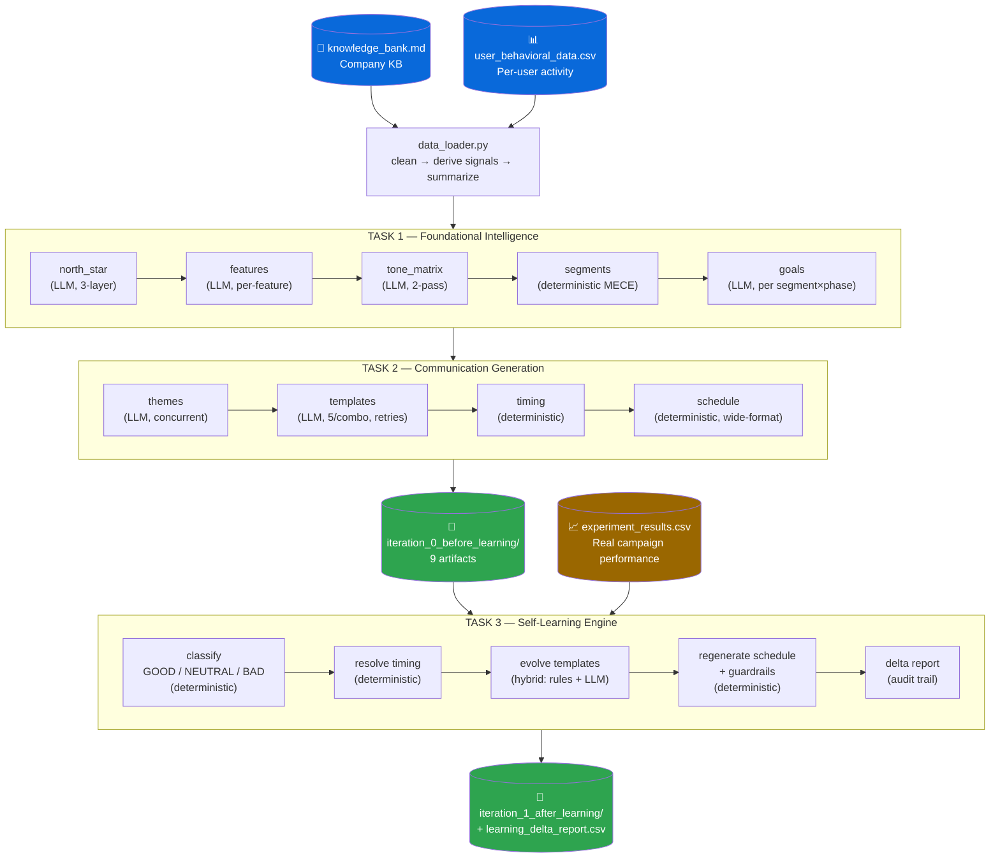

# Project Aurora — Self-Learning Notification Orchestrator

> Turns a company knowledge base and raw user behavior data into a complete, bilingual, psychologically-grounded push-notification strategy — then rewrites its own output after seeing real campaign results.

[](https://www.python.org/)
[-000000?logo=ollama&logoColor=white)](https://ollama.com/)
[]()
[](https://pandas.pydata.org/)
[]()
[]()

---

## Table of Contents

1. [The Problem](#the-problem)
2. [Why It's Useful](#why-its-useful)
3. [Key Features](#key-features)
4. [Architecture & Workflow](#architecture--workflow)
5. [Tech Stack](#tech-stack)
6. [Project Structure](#project-structure)
7. [Installation & Usage](#installation--usage)
8. [Sample Input](#sample-input)
9. [Sample Output](#sample-output)
10. [Data & Schema Reference](#data--schema-reference)
11. [End-to-End Example Workflow](#end-to-end-example-workflow)
12. [Technical Highlights](#technical-highlights)
13. [Results & Scale](#results--scale)
14. [Future Improvements](#future-improvements)
15. [Engineering Skills Demonstrated](#engineering-skills-demonstrated)
16. [License](#license)

---

## The Problem

Consumer apps (ed-tech, fintech, D2C, SaaS) all face the same operational bottleneck: turning a pile of user-activity data into a *good* notification strategy requires a chain of manual work that rarely gets done well —

- A PM has to decide **who** the meaningful user segments are.
- A strategist has to decide **what** message theme and psychological hook fits each segment at each point in their lifecycle.
- A copywriter has to write **dozens of message variants**, often in more than one language.
- Someone has to decide **when** to send each message, and **how often**, without triggering fatigue or uninstalls.
- After the campaign runs, someone has to **read the results and manually rewrite** whatever didn't work.

This is slow, inconsistent across segments, and rarely revisited — most teams ship one notification strategy and never systematically learn from it.

**Project Aurora automates the entire chain.** Given only a company knowledge base and a user-activity CSV, it produces a complete notification strategy — segments, goals, themes, bilingual copy, timing, and a full delivery schedule — and then, given real campaign results, autonomously evolves that strategy for the next iteration, with a full audit trail of what changed and why.

## Why It's Useful

- **Removes the manual strategy chain.** One command replaces a PM + strategist + copywriter + analyst workflow for the first-draft notification plan.
- **Domain-agnostic by construction.** Swap the knowledge base and the CSV for a different company (fintech, SaaS, e-commerce) and the entire pipeline re-targets itself — no code changes. Features, tones, goals, and segments are all discovered at runtime, never hardcoded.
- **Closes the feedback loop.** Most systems generate a strategy once. Aurora consumes real CTR/engagement/uninstall data and rewrites underperforming content automatically, with every change logged and explainable.
- **Zero marginal cost.** All text generation runs on a local LLM via [Ollama](https://ollama.com) — no API keys, no per-token billing, fully offline.
- **Safe by design.** Every creative (LLM) stage sits behind a deterministic guardrail or fallback, so a bad or malformed model response degrades gracefully instead of breaking the pipeline.

## Key Features

| Feature | Description |
|---|---|
| **MECE user segmentation** | 13 mutually-exclusive, collectively-exhaustive behavioral segments (+1 catch-all), computed deterministically from an RFM-style activeness score and per-feature propensity. |
| **North-star & goal inference** | Extracts or infers the company's north-star metric from the KB, then maps every product feature to the goal it should drive. |
| **Octalysis-based psychology engine** | Classifies every message by one of the 8 Octalysis gamification drives (Epic Meaning, Scarcity, Loss Avoidance, etc.), matched to an 11-phase lifecycle model (trial → paid → churned → inactive). |
| **Bilingual copywriting at scale** | Generates 5 distinct message templates (title/body/CTA) per segment × lifecycle phase, in transcreated English **and** Hindi — not literal translation. |
| **Deterministic timing & scheduling** | Computes each segment's best delivery windows from real `preferred_hour` data and builds a full 9-slot daily notification schedule with a push/in-app/email channel mix. |
| **Self-learning feedback loop** | Ingests real campaign results, classifies every template GOOD/NEUTRAL/BAD, keeps what works, LLM-rewrites what doesn't, shifts timing to the best-performing window, and cuts frequency for segments that breach an uninstall guardrail. |
| **Full audit trail** | Every learning-phase change (template swap, timing shift, frequency cut) is written to `learning_delta_report.csv` with its trigger, before/after value, and causal explanation. |
| **Fault-isolated CLI orchestrator** | Run the whole pipeline, one task, or a single step; failed steps are logged and skipped without halting the run; completed steps cache to disk for cheap re-runs. |

## Architecture & Workflow

Two inputs — a **Knowledge Bank** and a **behavioral CSV** — flow through three tasks. Task 1 and 2 always run together to produce the baseline strategy (Iteration 0); Task 3 runs later, once real campaign data exists, to produce an evolved strategy (Iteration 1).



**Design principle — deterministic where it counts, LLM where it adds value.** Segmentation, timing, scheduling, classification, and guardrail enforcement are pure, reproducible Python. The local LLM is used *only* for strategic reasoning and creative copy — and every LLM call has a hand-written fallback so the pipeline never hard-fails on a bad or missing model response.

## Tech Stack

| Layer | Technology | Notes |
|---|---|---|
| Language | Python 3.10+ | Uses modern type-union syntax (`X \| Y`) |
| Data processing | pandas, NumPy | Signal derivation, CSV I/O, segmentation math |
| LLM runtime | [Ollama](https://ollama.com) (`llama3.2:3b` default) | Local inference, no cloud API, swappable for any Ollama model |
| LLM transport | `requests` → Ollama `/api/generate` | Custom robust JSON parser with 3-tier fallback |
| Concurrency | `concurrent.futures.ThreadPoolExecutor` | Parallelizes the two heaviest LLM stages (themes, templates) |
| Config | Single `config.py` module | Model IDs, paths, taxonomies, thresholds — one source of truth |
| CLI | `argparse` | Step/alias-based orchestrator with fault isolation |
| Storage | Flat CSV / JSON files | No database — intentional for a demo/prototype scope |

No cloud services, no vector database, no external API keys — the entire system runs on a laptop.

## Project Structure

```
Speakx_Aurora/
├── codebase/                          # ~6,200 lines of Python
│   ├── config.py                      # Constants: model, paths, Octalysis drives, time windows, thresholds
│   ├── llm.py                         # Ollama wrapper + 3-tier robust JSON parsing
│   ├── kb_loader.py                   # KB loading + full-text prompt-context builder
│   ├── data_loader.py                 # CSV load/clean, signal derivation (activeness, churn, propensity)
│   ├── gen_north_star.py              # Task 1 → company_north_star.json          (LLM, 3-layer)
│   ├── gen_feature_goal_map.py        # Task 1 → feature_goal_map.json            (LLM, per feature)
│   ├── gen_tone_hook_matrix.py        # Task 1 → allowed_tone_hook_matrix.json    (LLM, 2-pass)
│   ├── segmentation_engine.py         # Task 1 → user_segments.csv                (deterministic)
│   ├── goal_builder.py                # Task 1 → segment_goals.csv                (LLM, per segment×phase)
│   ├── comm_themes.py                 # Task 2 → communication_themes.csv         (LLM, concurrent)
│   ├── message_template_gen.py        # Task 2 → message_templates.csv            (LLM, concurrent + retries)
│   ├── timing_optimizer.py            # Task 2 → timing_recommendations.csv       (deterministic)
│   ├── notification_scheduler.py      # Task 2 → user_notification_schedule.csv   (deterministic)
│   ├── learning_engine.py             # Task 3 → iteration_1 outputs + delta report (hybrid, 2,359 lines)
│   └── main.py                        # CLI orchestrator — steps, aliases, fault isolation
│
├── iteration_0_before_learning/       # Baseline strategy (9 artifacts)
├── iteration_1_after_learning/        # Post-learning evolved strategy
├── user_behavioral_data.csv           # INPUT — per-user activity (demo data, 60 users)
├── experiment_results.csv             # INPUT — real/simulated campaign results (75 rows)
├── knowledge_bank.md / speakx_kb.txt  # INPUT — company knowledge base
└── docs/                              # Full documentation set (see below)
```

**In-depth documentation** already lives in [`docs/`](docs/) and is the authoritative reference for anyone extending the system:

| Doc | Covers |
|---|---|
| [PROJECT_OVERVIEW.md](docs/PROJECT_OVERVIEW.md) | Concepts, phases, design principles |
| [ARCHITECTURE.md](docs/ARCHITECTURE.md) | Data flow, deterministic/LLM split, learning engine internals |
| [APP_STRUCTURE.md](docs/APP_STRUCTURE.md) | Module-by-module responsibility map |
| [API_REFERENCE.md](docs/API_REFERENCE.md) | Every public function and constant |
| [DATA_FORMATS.md](docs/DATA_FORMATS.md) | Exact schema of every input/output file |
| [MODELS_DOCUMENTATION.md](docs/MODELS_DOCUMENTATION.md) | LLM backend, prompting strategy, reliability engineering |
| [INSTALLATION.md](docs/INSTALLATION.md) / [QUICK_START.md](docs/QUICK_START.md) | Setup and command reference |
| [IMPLEMENTATION_SUMMARY.md](docs/IMPLEMENTATION_SUMMARY.md) | One-read summary of the whole build |

## Installation & Usage

### Prerequisites

| Requirement | Notes |
|---|---|
| Python 3.10+ | |
| [Ollama](https://ollama.com) | Local LLM runtime, serves on `http://localhost:11434` by default |
| ~4 GB disk, 8 GB RAM | For the default `llama3.2:3b` model |
| `pandas`, `numpy`, `requests` | Only third-party dependencies — no `requirements.txt` in the repo yet |

### Setup

```bash
# 1. Install Ollama, then pull the default model
ollama pull llama3.2:3b

# 2. Install Python dependencies
pip install pandas numpy requests

# 3. Confirm the pipeline is wired up
cd codebase
python main.py --list
```

### Run it

```bash
# Generate the baseline strategy (Task 1 + Task 2) → iteration_0_before_learning/
python main.py

# ... a real (or simulated) campaign runs, producing experiment_results.csv ...

# Learn from the results (Task 3) → iteration_1_after_learning/ + learning_delta_report.csv
python main.py --steps task3
```

### Other useful invocations

```bash
python main.py --steps task1              # only strategy: north_star, features, tone_matrix, segments, goals
python main.py --steps templates           # regenerate a single step (re-uses cached upstream artifacts)
python main.py --data ../my_users.csv      # run against a different behavioral CSV
python main.py --out0 ../run2              # write Task 1/2 output elsewhere
```

Full flag reference and troubleshooting: [QUICK_START.md](docs/QUICK_START.md), [INSTALLATION.md](docs/INSTALLATION.md).

## Sample Input

**`user_behavioral_data.csv`** — one row per user (this demo dataset: 60 users):

```csv
user_id,lifecycle_stage,days_since_signup,age_band,region,sessions_last_7d,exercises_completed_7d,streak_current,coins_balance,feature_ai_tutor_used,feature_leaderboard_viewed,feature_progress_checked,preferred_hour,notif_open_rate_30d,motivation_score
US_1,paid,119,25-34,tier2,5,16,22,453,FALSE,FALSE,TRUE,7,0.304,0.65
US_3,trial,3,25-34,tier2,9,9,5,90,FALSE,TRUE,TRUE,9,0.435,0.51
```

Any number of `feature_*` boolean columns are auto-discovered — swap in a different product's feature flags and the pipeline adapts without code changes.

**`experiment_results.csv`** — one row per template after a campaign runs (75 rows in the demo set):

```csv
template_id,segment_id,...,notification_window,total_sends,total_opens,total_engagements,ctr,engagement_rate,uninstall_rate
TPL_SEG_01_PREMIUM_AFFIRMATION_01,SEG_01,...,evening,5000,1050,2850,0.2100,0.5700,0.0060
```

## Sample Output

**`company_north_star.json`** — the strategic north star, extracted from the KB and justified by the LLM:

```json
{
  "company": "SpeakX",
  "inferred_north_star": {
    "metric_name": "Monthly Retention",
    "how_it_was_determined": "explicit_extraction",
    "definition": "The percentage of trial users who convert to a monthly paid plan AND complete at least one exercise within that month.",
    "measurable_proxy": "(trial → monthly converters who complete ≥1 exercise) / (total trial users) × 100"
  },
  "supporting_metrics": [
    { "name": "W1 Retention", "definition": "% of new paid users who complete an exercise in their first week post-conversion" }
  ],
  "generated_at": "2026-03-07",
  "iteration": 0
}
```

**`message_templates.csv`** — bilingual, psychology-tagged copy (one of 5 templates for this segment × phase):

| Field | Value |
|---|---|
| `template_id` | `TPL_SEG_01_PREMIUM_AFFIRMATION_02` |
| `title_en` / `body_en` | "Ready to beat yesterday?" / "Your last score was 72. Can you top it in 5 minutes today?" |
| `title_hi` / `body_hi` | "आज की तुलना करें?" / "आपके पिछले स्कोर थे 72। आज के 5 मिनट में इसे पार कर सकते हैं?" |
| `hook_type` | `Epic Meaning` (Octalysis drive) |
| `format_type` | `question_hook` |
| `feature_ref` | `Role-Based Scenarios` |

**`user_notification_schedule.csv`** — the final wide-format delivery plan:

```
segment_id,segment_name,lifecycle_stage,lifecycle_day,notif_1,notif_2,...
SEG_01,High-Active Power Users,paid,D8,"(TPL_SEG_01_PREMIUM_AFFIRMATION_05, evening, push_notification)","(TPL_SEG_01_PREMIUM_AFFIRMATION_01, night, push_notification)",...
```

**After the learning phase** — a BAD template automatically suppressed and rewritten (`iteration_1_after_learning/message_templates.csv`):

| Field | Iteration 0 (original) | Iteration 1 (rewritten) |
|---|---|---|
| `template_id` | `TPL_SEG_06_ACTIVATION_..._01` | `TPL_SEG_06_ACTIVATION_..._01_v2` |
| `performance_status` | — | `BAD` (ctr 0.037, engagement 0.113, uninstall 0.028) |
| `title_en` | *(original copy, suppressed)* | "My Streak Was Dead, But SpeakX Brought Me Back to Life" |
| `theme` | *(original)* | `Empowerment` (forced theme swap from underperforming original) |
| `source_template_id` | — | `TPL_SEG_06_ACTIVATION_..._01` (A/B lineage preserved) |

## Data & Schema Reference

<details>
<summary><b>Input schemas</b></summary>

**`user_behavioral_data.csv`**

| Column | Type | Meaning |
|---|---|---|
| `user_id` | str | Unique user identifier |
| `lifecycle_stage` | str | `trial` / `paid` / `churned` / `inactive` |
| `days_since_signup` | int | Account age in days |
| `sessions_last_7d`, `exercises_completed_7d`, `streak_current` | int | Recent activity signals |
| `coins_balance` | float | In-app currency |
| `preferred_hour` | int | Preferred engagement hour (0–23) |
| `notif_open_rate_30d`, `motivation_score` | float (0–1) | Engagement propensity signals |
| `feature_*` | bool | One column per product feature — auto-discovered, names are free-form |

Derived at load time (not in the raw CSV): `activeness_score`, `churn_risk_score`, `propensity_<feature>` per feature.

**`experiment_results.csv`** (Task 3 input)

| Column | Meaning |
|---|---|
| `template_id`, `segment_id` | Links back to an Iteration 0 template/segment |
| `total_sends`, `total_opens`, `total_engagements` | Raw campaign counts |
| `ctr`, `engagement_rate`, `uninstall_rate` | Rates (0–1); backfilled from totals if absent |

Full schema for every input and output file: [DATA_FORMATS.md](docs/DATA_FORMATS.md).

</details>

<details>
<summary><b>Core computed signals</b></summary>

| Signal | Formula | Purpose |
|---|---|---|
| `activeness_score` | `0.30·Recency + 0.40·Frequency + 0.30·Magnitude` | RFM-style composite (0–1) driving segment activeness bands |
| `churn_risk_score` | `0.35·inactive + 0.25·zero_sessions + 0.20·zero_streak + 0.20·(1−open_rate)` | Weighted churn signal (0–1) |
| `propensity_<feature>` | `0.6·usage_flag + 0.4·motivation_score` | Per-feature affinity, computed for every discovered `feature_*` column |

</details>

<details>
<summary><b>The 14 behavioral segments</b></summary>

MECE segmentation by lifecycle stage × activeness band (percentile-based, 33rd/67th) × dominant feature propensity:

`SEG_01` High-Active Power Users · `SEG_02` High-Active Streak Keepers · `SEG_03` High-Active Trial Converters · `SEG_04` Moderate-Active Feature Enthusiasts · `SEG_05` Moderate-Active Casual Paid · `SEG_06` Moderate-Active Trial Activators · `SEG_07` Moderate-Active Trial Fence-Sitters · `SEG_08` Low-Active At-Risk Paid · `SEG_09` Low-Active Cold Trial · `SEG_10` Recent Churned · `SEG_11` Deep Churned · `SEG_12` Inactive High-Propensity · `SEG_13` Inactive Low-Propensity · `SEG_14` Unclassified (catch-all)

</details>

<details>
<summary><b>Learning-phase classification thresholds</b></summary>

| Class | CTR | Engagement | Action |
|---|---|---|---|
| GOOD | ≥ 0.15 | ≥ 0.40 | Kept as-is, used as a style reference |
| NEUTRAL | ≥ 0.05 | ≥ 0.20 | LLM-iterated: same theme, sharper hook |
| BAD | below NEUTRAL | below NEUTRAL | Suppressed, theme swapped, fully LLM-rewritten |

Plus a send-weighted **uninstall guardrail** (0.02 threshold) that cuts a segment's daily notification frequency by 2 if breached.

</details>

## End-to-End Example Workflow

1. **Input.** Drop in `knowledge_bank.md` (company brief) and `user_behavioral_data.csv` (60 users with activity + feature-usage flags).
2. **`python main.py`** runs Task 1 + Task 2:
   - Extracts the north star (*Monthly Retention*) from the KB.
   - Maps 3 discovered features (`Sia — AI Speaking Partner`, `Leaderboard`, `Progress Checked`) to the goals they should drive.
   - Builds an 8-drive Octalysis tone/hook matrix from the KB's ethical communication guidelines.
   - Deterministically segments the 60 users into 8 populated MECE segments (of 14 possible).
   - Generates per-segment/per-phase goals across an 11-phase lifecycle model.
   - Generates communication themes, then 5 bilingual message templates per segment × phase (135 templates total in this demo run).
   - Computes each segment's best delivery windows and expands them into a full wide-format 9-slot daily schedule.
   - **Result:** 9 artifacts in `iteration_0_before_learning/`.
3. **A campaign runs** (or is simulated) using that schedule, producing `experiment_results.csv` — 75 rows of real CTR/engagement/uninstall data per template.
4. **`python main.py --steps task3`** runs the learning engine:
   - Classifies every template GOOD/NEUTRAL/BAD against the thresholds above.
   - Detects segments breaching the uninstall guardrail and cuts their frequency.
   - Shifts each segment's timing to its best-observed window.
   - Keeps GOOD templates, sharpens NEUTRAL ones, and fully rewrites BAD ones (e.g. `TPL_SEG_06_ACTIVATION_..._01` → `..._01_v2`, new theme, new copy, lineage preserved via `source_template_id`).
   - Regenerates the schedule with the new templates, timings, and guardrail penalties.
   - **Result:** an evolved strategy in `iteration_1_after_learning/` plus a row-by-row `learning_delta_report.csv` explaining every change.

## Technical Highlights

- **Hybrid deterministic/LLM architecture.** Every stage that must be reproducible or auditable — segmentation, timing, scheduling, classification, guardrails — is pure Python with zero model involvement. The LLM is scoped strictly to strategy and creative text, each with a hand-written fallback (`gen_tone_hook_matrix` patches missing drives/stages with defaults; `message_template_gen` retries up to 3× then pads with fallback rows).
- **Robust JSON extraction from a small local model.** `llm.parse_json()` degrades through three tiers — standard parse → control-character/escape sanitization → regex field extraction — so a 3B-parameter model's imperfect JSON almost never breaks a downstream step. `safe_parse_json()` guarantees a usable value even on total failure.
- **Prompt decomposition over monolithic prompts.** North-star generation uses a 3-layer approach (explicit extraction → structured scoring → JSON assembly); tone/hook generation uses a 2-pass split; feature mapping, goals, themes, and templates all use one small, tightly-scoped LLM call per item rather than one giant prompt — measurably more reliable on a 3B model, and failures are isolated per item.
- **Full-context injection instead of RAG.** The knowledge base (~2–4K chars) is injected whole into every prompt rather than chunked and retrieved — a deliberate call that nothing is dropped and no vector-DB infrastructure is needed at this KB size (`kb_loader.build_context`).
- **Concurrency with backpressure.** The two heaviest LLM stages (`comm_themes.py`, `message_template_gen.py`) parallelize Ollama calls via `ThreadPoolExecutor(max_workers=2)` — faster wall-clock time without overwhelming a locally-hosted model.
- **Domain-agnostic feature discovery.** Any `feature_*` CSV column is auto-detected and gets its own propensity signal; nothing about a specific company's product is hardcoded in pipeline logic — verified by design in [ARCHITECTURE.md §5](docs/ARCHITECTURE.md#5-domain-agnosticism).
- **Send-weighted guardrail math.** Uninstall-rate guardrails are computed send-weighted per segment rather than as a naive average across templates, specifically to avoid Simpson's-paradox-style misreads when template send volumes are uneven.
- **Fault-isolated orchestration.** `main.py` wraps every pipeline step in try/except, logs and continues on failure, and passes state in-memory while allowing any step to reload upstream artifacts from disk — so a single failed or interrupted step never forces a full re-run.
- **Auditable self-learning with A/B lineage.** Rewritten templates get a `_v2` id and retain `source_template_id`, and every learning-phase change (template swap, timing shift, frequency cut) is written as a causal row to `learning_delta_report.csv` with its trigger and explanation — the learning engine's decisions (what changed) are deterministic and inspectable even though the new copy is LLM-generated.

## Results & Scale

This is a hackathon prototype run against a demo dataset, not a production deployment — treat these as **pipeline-scale figures from the included demo run**, not live product metrics.

| Metric | Value |
|---|---|
| Users processed | 60 |
| Behavioral segments populated | 8 of 14 defined |
| Segment × phase goal combinations | 24 |
| Bilingual message templates generated (Iteration 0) | 135 (5 per segment × phase) |
| Experiment/feedback rows ingested (Task 3 input) | 75 |
| Templates rewritten `_v2` after learning | 30 |
| Codebase size | ~6,200 lines of Python across 15 modules |
| External services required | 0 (fully offline) |

> **Placeholder:** production-scale benchmarks (throughput at 10K+ users, wall-clock time per pipeline run, LLM JSON-parse success rate) are not yet measured — see [Future Improvements](#future-improvements).

## Future Improvements

- [ ] Add a `requirements.txt` / `pyproject.toml` (dependencies currently documented in prose only).
- [ ] Add automated tests (unit tests for the deterministic stages — segmentation, timing, scheduling — would be high-value given they're pure functions).
- [ ] Add a real database backend instead of flat CSV/JSON files, for multi-run history and querying.
- [ ] Expose the pipeline behind an API/dashboard instead of a CLI-only orchestrator.
- [ ] Track and report LLM JSON-parse success/fallback rates as a reliability metric.
- [ ] Support larger/alternate LLM backends (currently pinned to `llama3.2:3b` by default; swappable but untested at scale in this repo).
- [ ] Multi-armed-bandit or statistical-significance testing for the GOOD/NEUTRAL/BAD classification, instead of fixed CTR/engagement thresholds.
- [ ] Extend beyond English/Hindi to additional languages using the same transcreation pattern.

## Engineering Skills Demonstrated

- **Systems/pipeline design** — a 10-step, 3-task, dependency-ordered orchestrator with state passing, disk-cache fallback, and fault isolation.
- **LLM application engineering** — prompt decomposition, multi-layer/multi-pass prompting strategies, robust output parsing, and reliability engineering around a small (3B) local model.
- **Data engineering** — signal derivation (RFM-style composites, churn scoring), CSV schema normalization with legacy-alias handling, deterministic MECE segmentation logic.
- **Concurrent programming** — `ThreadPoolExecutor`-based parallelization with explicit backpressure control for a shared local inference backend.
- **API/config design** — a single-source-of-truth `config.py`, a lazy-import CLI, and a clean deterministic/LLM architectural boundary that keeps the audit-critical logic model-free.
- **Domain modeling** — application of established frameworks (Octalysis gamification, RFM scoring, MECE segmentation, lifecycle-stage marketing) into working, generalizable code.
- **Documentation discipline** — a full `docs/` set (architecture, API reference, data formats, model behavior) maintained alongside the code.

## License

No license file is currently present in this repository. Add one (e.g. MIT, Apache-2.0) before public distribution or reuse.

---

<sub>Built for **SpeakX / KRITI 2026**. The knowledge base and behavioral data in this repo are demo/placeholder content standing in for a real company's data.</sub>
